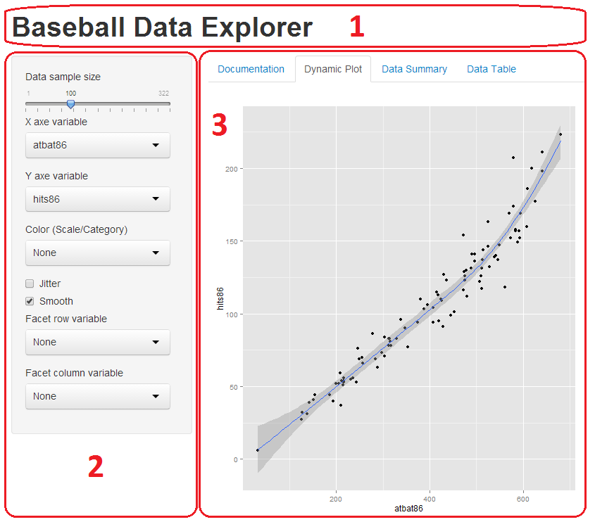

# Shiny web-app documentation
Web layout is dividen in 3 principal sections:

<table>
<tr><td><ul>
<li>Header panel (1)</li>
<li>Sidebar panel: Input controls (2)</li>
<li>Main panel: Tabset panel of four tabs (3)</li>
</ul></td>
<td></td>
</table>

## Interactive Elements
There are some elements available in the web application which you can interact with. The configuration you select with those elements will dynamically generate a graph in the "Dynamic Plot" tab:

<table width="100%">
<tr style="text-align:left">
<th width="70%">Sidebar panel (Input)</th>
<th>Tabset panel (View)</th>
<tr><td><ul>
<li>Slider: Controls the sample size</li>
<li>X,Y axes variables</li>
<li>Color variable</li>
<li>Facets variables: If you want to do split up your data by one or more variables and plot the subsets of data together.</li>
<li>Jitter: If you have many data points, or if your data scales are discrete, then the data points might overlap and it will be impossible to see if there are many points at the same location.</li>
<li>Smooth: Add linear regression line.</li></ul>
</td>
<td>
<li>Documentation</li>
<li>Dynamic Plot</li>
<li>Summary</li>
<li>Table</li></ul>
</td></tr></table>

## Data description: Baseball statistics
In this shiny aplication you can explore different variables of a Baseball dataset (1986-1987):

<table width="100%">
<tr style="text-align:left">
<th>Numerical variables</th>
<th>Categorical variables</th>
<tr><td><ul>
<li>atbat86: At Bat (86 league)</li>
<li>hits86: Hits (86 league)</li>
<li>homer86: Homeruns (86 league)</li>
<li>runs86: Runs (86 league)</li>
<li>rbi86: Runs  Batted In (86 league)</li>
<li>walks86: Base on Balls (86 league)</li>
<li>outs86: Outs (86 league)</li>
<li>assist86: Assists (86 league)</li>
<li>error86: Errors (86 league)</li>
<li>sal87: Salary ($) (86 league)</li>
</td>
<td>
<li>league86: League (86 league)</li>
<li>div86: Division (86 league)</li>
<li>team86: Team (86 league)</li>
<li>posit86: <a href="http://en.wikipedia.org/wiki/Baseball_positions">Baseball positions (86 league)</a></li>
<li>league87: League (87 league)</li>
<li>team87: Team (87 league)</li></ul>
</td></tr></table>
