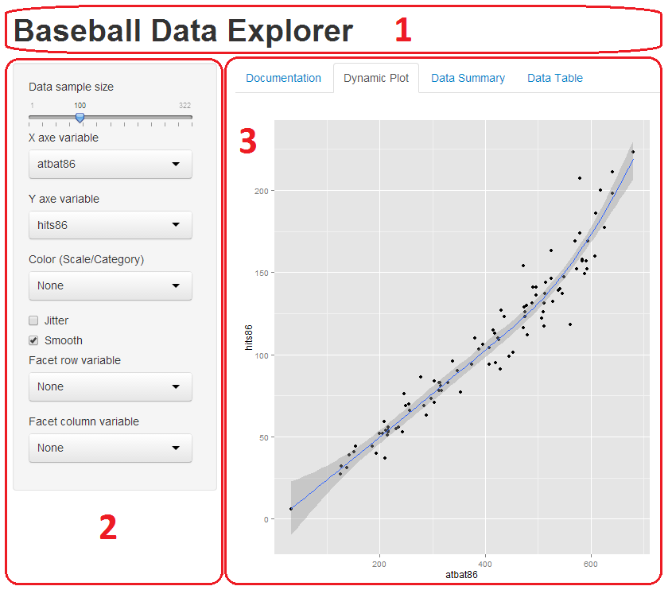

## Reproducible Pitch Presentation

This is a "Slidify" presentation to briefly describe the how-to development of my shiny aplication.

The content will contain 3 principal sections:

* Layout
* Interactive Elements
* Data Visualization

Data description: Baseball statistics

<table>
<tr><th>Numerical variables</th><th>Categorical variables</th>
<tr><td><ul>
<li>atbat86: At Bat (86 league)</li>
<li>hits86: Hits (86 league)</li>
<li>homer86: Homeruns (86 league)</li>
<li>(...)</li>
</td>
<td>
<li>league86: League (86 league)</li>
<li>div86: Division (86 league)</li>
<li>team86: Team (86 league)</li>
<li>(...)</li></ul>
</td></tr></table>

---
## Layout
This Shiny application is divided into 3 parts, beeing 2 of them the most importants:

<table>
<tr><td><ul>
<li>Header panel (1)</li>
<li>Sidebar panel: Input controls (2)</li>
<li>Main panel: Tabset panel of 4 tabs with different views (3)</li></ul></td>
<td></td>
</table>

---
## Interactive Elements
The user has some elements available in the web application which he can interact with. The configuration the user selects with those elements will dynamically generate a graph in the "Plot" tab:

<table>
<tr><th>Sidebar panel (Input)</th><th>Tabset panel (View)</th>
<tr><td><ul>
<li>Slider (Sample/Size)</li>
<li>X,Y axes variables</li>
<li>Color variable</li>
<li>Facets variables</li>
<li>Jitter</li>
<li>Smooth</li></ul>
</td>
<td>
<li>Documentation</li>
<li>Dynamic Plot</li>
<li>Summary</li>
<li>Table</li></ul>
</td></tr></table>

---
## Data Visualization: Shiny plot examples

 

 

